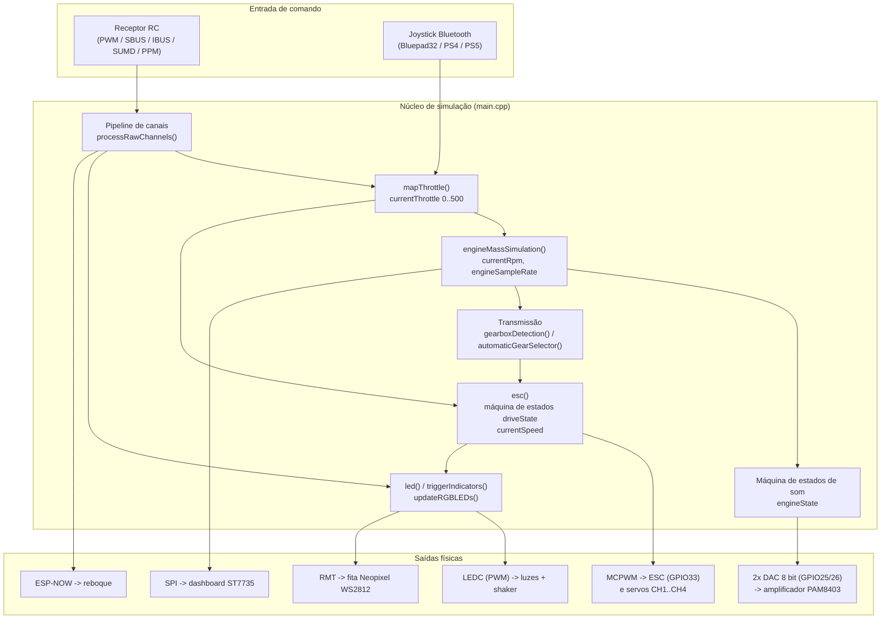
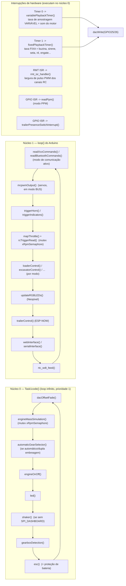

# 02 — Arquitetura

Quase todo o firmware está em `src/main.cpp` (~5.700 linhas). Os arquivos `0_*.h` ..
`10_*.h`, `profiles/*.h`, `tuning/*.h`, `BluetoothMapping.h` e `vehicles/*.h` são
**incluídos** por `main.cpp` e contêm só `#define`s / variáveis de configuração. Os únicos `.cpp`
separados são `src/input/BluetoothInput.cpp` (receptor virtual Bluetooth) e os
auxiliares em `src/src/` (`SUMD.cpp`, `sbus.cpp`, `dashboard.cpp`). `main.h` traz as
_forward declarations_ que esses `.cpp` precisam.

## Camadas lógicas



## Modelo de execução (FreeRTOS / dual-core)

O ESP32 tem 2 núcleos. O firmware divide o trabalho para garantir que a geração de
áudio nunca sofra _jitter_:



Detalhes importantes:

- `Task1code` é criada em `setup()` com `xTaskCreatePinnedToCore(..., core 0)`, stack 8192.
- O `loop()` do Arduino roda no **núcleo 1** por padrão.
- `disableCore0WDT()` é chamado — a Task1 roda sem `delay()`, então o watchdog do
  núcleo 0 é desligado. Um **RTC WDT** de 10 s é armado e precisa ser "alimentado"
  (`rtc_wdt_feed()`) nos dois laços; se algum travar, o chip reinicia.
- **Mutexes**: `xRpmSemaphore` protege o grupo `currentRpm` / `currentThrottle` /
  gear state compartilhado entre os dois núcleos; `xPwmSemaphore` existe para a
  variável de PWM (uso legado).
- Os dois timers de playback reprogramam o próprio `timerAlarmWrite()` a cada disparo
  para variar a taxa de amostragem conforme o RPM.

## Sequência de `setup()`

```mermaid
sequenceDiagram
    participant S as setup()
    S->>S: disableCore0WDT() + arma RTC WDT (10 s)
    S->>S: Serial.begin(115200)
    S->>S: battery.attach(GPIO39)
    S->>S: imprime infos de sistema / reset reason
    S->>S: setupEeprom()  (lê ou grava defaults conforme eeprom_id)
    S->>S: cria mutexes xPwmSemaphore / xRpmSemaphore
    S->>S: pinMode + attachInterrupt (chave de engate)
    S->>S: begin() de cada statusLED (faróis, setas, shaker...) em canais LEDC 2..15
    S->>S: setupEspNow()
    S->>S: setupNeopixel()  (FastLED, se NEOPIXEL_ENABLED)
    S->>S: seleção do modo de comunicação (BLUETOOTH/SBUS/IBUS/PPM/SUMD/PWM) + setupMcpwm()
    Note over S: se BLUETOOTH_COMMUNICATION: setupBluetoothInput() (callbacks BP32)
    S->>S: xTaskCreatePinnedToCore(Task1code, core 0)
    S->>S: dacWrite(DAC1/DAC2, 0)
    S->>S: timerBegin(0) -> variablePlaybackTimer ; timerBegin(1) -> fixedPlaybackTimer
    S->>S: espera o receptor RC / o gamepad conectar (loop de flash nas setas)
    S->>S: calcula faixas de pulso por canal (pulseZero=1500 +/- pulseSpan)
    S->>S: setupMcpwmESC()
```

## Convenção de nomes dos "canais"

O firmware trabalha internamente com um array `pulseWidth[1..13]` em **microssegundos**
(1000–2000, centro 1500), independente do protocolo de entrada. O mapeamento
"canal do rádio → canal do controlador" é feito pelos `#define STEERING/THROTTLE/...`
no perfil de rádio em `2_Remote.h`. Ver [04 — Entrada de controle](04-entrada-de-controle.md).

| Canal interno | Função padrão |
|---------------|---------------|
| CH1 | Direção (ou caçamba, em loader/excavator) |
| CH2 | Câmbio 3 posições (ou lança) |
| CH3 | Acelerador + freio |
| CH4 | Buzina / giroflex / sirene |
| CH5 | `FUNCTION_R` — jake brake, farol alto, lampejo, motor on/off |
| CH6 | `FUNCTION_L` — setas, pisca-alerta |
| CH7 | `POT2` |
| CH8 / CH9 | `MODE1` / `MODE2` |
| CH10..CH13 | `MOMENTARY1`, `HAZARDS`, `INDICATOR_LEFT/RIGHT` |
