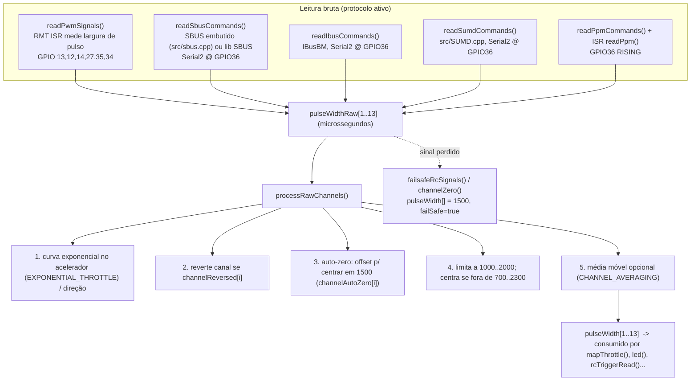

# 04 — Entrada de controle

Há duas fontes de comando que convergem para as mesmas variáveis internas
(`pulseWidth[]`, `currentThrottle`, flags de função):

1. **Receptor RC** — um de cinco protocolos, selecionado por `#define` em `2_Remote.h`.
2. **Joystick Bluetooth** — `src/BluetoothController.cpp` (Bluepad32), específico deste fork.

## Pipeline do receptor RC



Pontos-chave:

- **Protocolo ativo neste checkout:** `IBUS_COMMUNICATION` (`2_Remote.h` linha 34).
  `SBUS_COMMUNICATION` está comentado. Em `setup()` e `loop()` a escolha é uma cadeia
  `#if defined SBUS_COMMUNICATION / #elif defined IBUS_COMMUNICATION / ... / #else PWM`.
- **`EMBEDDED_SBUS`** (definido) usa `src/sbus.cpp` em vez da biblioteca externa —
  recomendado pelo upstream.
- Todos os modos BUS compartilham **`COMMAND_RX = GPIO36`** e o `Serial2`.
- `pulseNeutral = 30` (zona morta em torno de 1500), `pulseSpan = 480` (curso útil),
  `pulseLimit = 1100`, faixa válida `700..2300 µs`. Definidos por perfil de rádio.
- `MAX_RPM_PERCENTAGE` é reduzido conforme o protocolo (`maxIbusRpmPercentage = 320`,
  demais 390) para não travar o ESP em RPM alto.
- **Auto-zero:** canais marcados `channelAutoZero[i] = true` precisam estar entre
  1400–1600 µs na energização, senão as setas piscam o número do canal problemático e
  `autoZeroDone` nunca fica `true` (o `led()` só roda depois disso).

### Perfis de rádio (`2_Remote.h`)

Um `#ifdef` por rádio define o mapeamento `#define STEERING/GEARBOX/THROTTLE/HORN/
FUNCTION_R/FUNCTION_L/POT2/MODE1/MODE2/...` (número do canal do **rádio**), além das
tabelas `channelReversed[14]` e `channelAutoZero[14]`, e flags `AUTO_LIGHTS`,
`AUTO_ENGINE_ON_OFF`, `AUTO_INDICATORS`.

Perfis disponíveis: `FLYSKY_FS_I6X`, **`FLYSKY_FS_I6S_LOADER`** (ativo),
`FLYSKY_FS_I6S_EXCAVATOR`, `FLYSKY_GT5`, `RGT_EX86100`, `GRAUPNER_MZ_12`,
`MICRO_RC`, `MICRO_RC_STICK`.

Perfil ativo — `FLYSKY_FS_I6S_LOADER` (para a Volvo L120H, usar IBUS):

| `#define` | Canal rádio | Papel na carregadeira |
|-----------|-------------|-----------------------|
| `STEERING 1` | 1 | Caçamba |
| `GEARBOX 2` | 2 | Lança (lift) |
| `THROTTLE 3` | 3 | Acelerador + freio |
| `HORN 9` | 9 | Buzina / giroflex (chave 3 pos. SWB) |
| `FUNCTION_R 7` | 7 | Jake brake, farol, lampejo, motor on/off (VRB) |
| `FUNCTION_L 6` | 6 | Setas, pisca-alerta (VRA) |
| `POT2 / MODE1 / MODE2 / ...` | `NONE` | não usados |

### Leitura de gatilhos e funções

- `rcTriggerRead()` interpreta `pulseWidth[FUNCTION_R]` / `[FUNCTION_L]` (eixos analógicos
  ou chaves de 3 posições) em ações curtas/longas via objetos `rcTrigger`
  (`functionR100u`, `functionL75r`, `mode1Trigger`, `hazardsTrigger`, ...).
- `triggerHorn()` e `triggerIndicators()` rodam no `loop()`.
- `beaconControl()` conta pulsos no CH3 para alternar modos de giroflex.

## Conversão para acelerador — `mapThrottle()`

Executa no `loop()` sob `xRpmSemaphore`. Ramo escolhido por `#if`:

| Modo | Fonte do `currentThrottle` (0..500) |
|------|-------------------------------------|
| `TRACKED_MODE` | maior valor entre CH2 e CH3 (mistura de lagartas) |
| `EXCAVATOR_MODE` | CH3 (só para frente), com abaixamento de RPM após 5 s sem hidráulica |
| `AIRPLANE_MODE` | CH3 acima de 1100 µs, embreagem sempre solta |
| **Normal** (ativo) | `currentThrottle = getBLTCurrentThrottle();` — **vem do joystick Bluetooth** |

> No fork, o ramo "normal" foi alterado: em vez de mapear `pulseWidth[3]` para 0..500,
> ele pega o valor calculado pelo `BluetoothController`. O `if` externo ainda exige que
> `pulseWidth[3]` pareça um pulso de servo válido, então **o receptor RC ainda precisa
> estar presente e centrado** para o acelerador Bluetooth ter efeito.

Depois do valor bruto, `mapThrottle()` também:

- aplica _auto-throttle_ durante trocas de marcha (sincronização de câmbio Tamiya);
- faz o _fade_ de `currentThrottleFaded` (rampa suave de ±2 a cada 0,5 ms);
- calcula todos os **volumes dependentes de rotação/acelerador** (idle, rev, knock diesel,
  turbo, ventoinha, compressor, wastegate, tire squeal) — consumidos pelo motor de som;
- calcula `engineLoad = currentThrottle - currentRpm` (0..180) para o conversor de torque.

## Camada Bluetooth (`BluetoothController`)

Arquivos: `src/BluetoothController.h`, `src/BluetoothController.cpp`. Depende de
`<Bluepad32.h>`, que só existe porque o `platformio.ini` troca o pacote do framework
Arduino pelo fork **`pio-framework-bluepad32`**.

```mermaid
sequenceDiagram
    participant setup as setup()
    participant loop as loop()
    participant BP32 as Bluepad32
    participant Pad as Controle PS4/PS5

    setup->>BP32: setupBluetoothController()
    Note over setup,BP32: BP32.setup(onConnected, onDisconnected)\nBP32.forgetBluetoothKeys()\nBP32.enableVirtualDevice(false)
    Pad-->>BP32: pareia (modo pairing do controle)
    BP32-->>setup: onConnectedController(ctl) -> myControllers[i] = ctl

    loop->>BP32: loopBluetoothController()  (a cada 50 ms)
    BP32->>BP32: BP32.update()
    alt dados novos
        BP32->>loop: processControllers() -> processGamepad(ctl)
        loop->>loop: processThrottle(ctl)
        Note over loop: axisRY (analógico dir. Y) ou throttle()/R2 (se manualMode)\n-> BLT_CURRENT_THROTTLE (map p/ 0..500)\n-> ledcWrite(10/11) ponte-H, digitalWrite(22) luz de ré
        loop->>loop: botão A -> engineOnOff() + setColorLED
        loop->>loop: botão X -> triggerHorn() + playDualRumble
        loop->>loop: botão B -> setPlayerLEDs
    end
```

`processThrottle()` em detalhe:

- `AuxjoyDireitaY = ctl->axisRY()` (−511..512).
- **Frente** (`AuxjoyDireitaY <= -10`): `BLT_CURRENT_THROTTLE = map(..., 4, -508, 0, 500)`;
  `ledcWrite(11, throttle)`, `ledcWrite(10, 0)`, apaga luz de ré (GPIO22 LOW).
- **Neutro** (`-10..10`): se saiu de movimento há < 600 ms marca `freio = true`.
- **Ré** (`>= 10`): `map(..., 5, 512, 0, 255)`; `ledcWrite(10, throttle)`, `ledcWrite(11, 0)`.
- `manualMode` (default `false`): quando `true`, o acelerador vem do gatilho R2
  (`ctl->throttle()`, 0..1020 → 0..500) em vez do analógico.
- `getBLTCurrentThrottle()` devolve `BLT_CURRENT_THROTTLE` para o `mapThrottle()`.

Ressalvas (ver também [03 — Hardware](03-hardware-e-pinos.md#conflitos-introduzidos-pela-camada-bluetooth)):

- Os `ledcWrite(10/11)` e `digitalWrite(22)` **colidem** com giroflex 2, 3ª luz de freio
  e luzes de cabine na pinagem padrão. É código de tração para uma fiação própria.
- Não há _timeout_/failsafe próprio na camada BT: se o controle desconectar, o último
  `BLT_CURRENT_THROTTLE` permanece até o próximo `processControllers()`.
- `BP32.forgetBluetoothKeys()` é chamado em todo boot — o controle precisa re-parear.
- Muitos `Serial.print` dentro de `processThrottle()` a cada frame — ruído no monitor e
  custo de CPU; remover para uso final.
