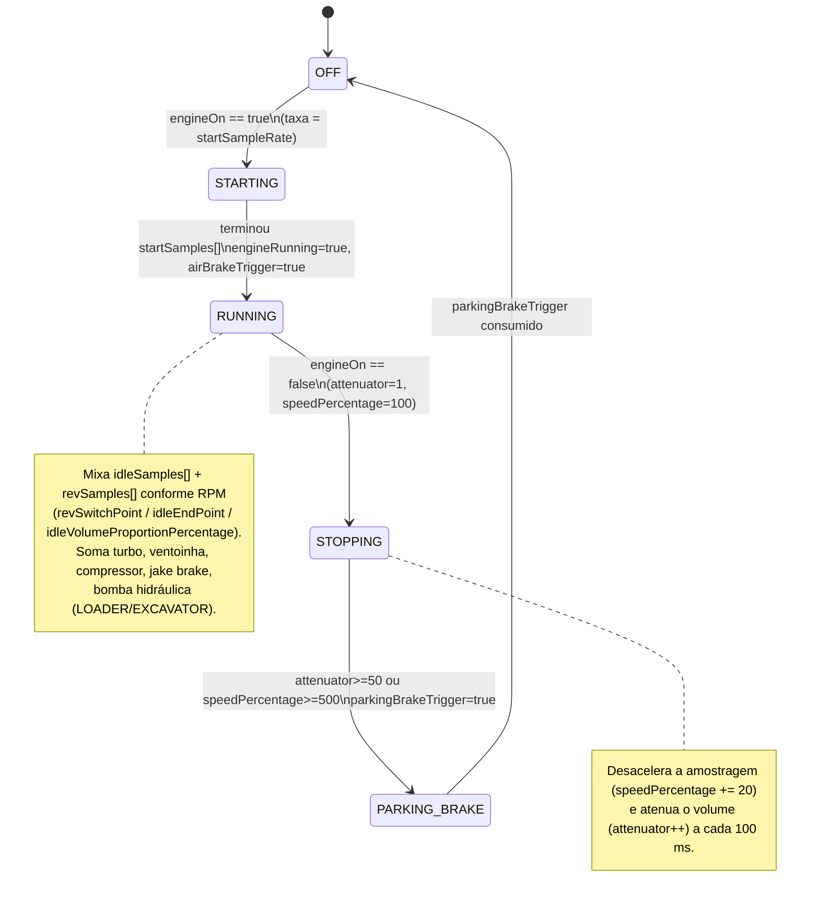

# 05 — Motor de som

O áudio é **PCM de 8 bits** sintetizado em tempo real dentro de duas ISRs de timer,
escrito direto nos registradores dos DACs internos do ESP32.

## Dois timers, dois DACs

| Timer | ISR | Taxa | DAC | Conteúdo |
|-------|-----|------|-----|----------|
| Timer 0 | `variablePlaybackTimer()` | **variável** (segue o RPM: `engineSampleRate`) | `DAC1` = GPIO25 (`RTC_IO_PAD_DAC1_REG`) | Som do motor: idle + rev + partida + jake brake + turbo + ventoinha + compressor + bomba hidráulica + chocalho de esteira |
| Timer 1 | `fixedPlaybackTimer()` | **fixa** (`sampleRate` do arquivo de som) | `DAC2` = GPIO26 (`RTC_IO_PAD_DAC2_REG`) | Buzina, sirene, seta, ré, freio de ar, freio de estacionamento, troca de marcha, engate/desengate, `sound1` (porta), squeal de pneu, mensagem "sem combustível", knock diesel, chocalho de caçamba |

Ambos os DACs alimentam o mesmo amplificador PAM8403; um potenciômetro de 20k soma/
atenua os dois canais (controle de volume analógico). O `dacOffset` (≈128) é subido
lentamente por `dacOffsetFade()` na partida para evitar "pop".

`variableTimerTicks` / `fixedTimerTicks` são reescritos com `timerAlarmWrite()` a
**cada disparo** da ISR — é assim que a taxa acompanha o RPM (nota de motor sobe/desce).

- `maxSampleInterval = 4000000 / sampleRate` (RPM mínimo)
- `minSampleInterval = 4000000 / sampleRate * 100 / MAX_RPM_PERCENTAGE` (RPM máximo)
- `engineSampleRate = map(_currentRpm, minRpm, maxRpm, maxSampleInterval, minSampleInterval)`

## Máquina de estados do som do motor (`engineState`)

Vive dentro de `variablePlaybackTimer()`. Enum: `OFF`, `STARTING`, `RUNNING`,
`STOPPING`, `PARKING_BRAKE`.



`engineOn` / `engineStart` / `engineRunning` / `engineStop` são flags `volatile`
compartilhadas com o resto do firmware (dashboard, luzes, shaker).

## Mixagem

### DAC1 (`variablePlaybackTimer`)
```
value = clamp( (a*0.8) + (b/2) + (c/5) + (d/5) + (e/5) + f + g ) * masterVolume/100 + dacOffset , 0..255)
```
| var | fonte |
|-----|-------|
| `a` | motor (idle+rev mixados, ou partida/parada) |
| `b` | jake brake |
| `c` | turbo |
| `d` | ventoinha |
| `e` | compressor (supercharger) |
| `f` | bomba hidráulica |
| `g` | chocalho de esteira (locomotiva/escavadeira) |

### DAC2 (`fixedPlaybackTimer`)
```
value = clamp( (a*0.8) + (b*0.2) + c + d ) * masterVolume/100 + dacOffset , 0..255)
a = a1 + a2                       # buzina + sirene
b = b0*5 + b1 + b2/2 + b3..b9     # ré, freio de ar, freio de estac., troca, engate, desengate, sound1, indicador...
c = c1 + c2 + c3                  # sons de escavadeira (hidráulico hiss, flow, chocalho de caçamba)
d = d1 + d2                       # squeal de pneu + mensagem "out of fuel"
```

Cada sub-som é: `amostra[i] * volumePercentagem_do_arquivo / 100 * volumeDinâmico / 100`,
onde o volume dinâmico vem de `mapThrottle()` (dependente de acelerador/RPM) e os
"triggers" (`hornTrigger`, `sirenTrigger`, `airBrakeTrigger`, `shiftingTrigger`,
`couplingTrigger`, `sound1trigger`, `outOfFuelMessageTrigger`, ...) ligam/desligam
o avanço do índice `curXxxSample`.

## Arquivos de som

- Ficam em `src/vehicles/sounds/*.h` como arrays `const` em **PROGMEM/flash**
  (`samples[]`, `revSamples[]`, `startSamples[]`, `hornSamples[]`, ...), cada um com
  seu `...SampleCount` e `sampleRate`/`startSampleRate`.
- Recomendado: **22.050 Hz, 8 bit, PCM mono**.
- O arquivo do veículo (`8_Sound.h` do veículo, ex. `vehicles/VolvoL120H.h`) faz
  `#include` de qual som usar para cada função e define os `...VolumePercentage`.
- Ferramentas de conversão: `tools/Audio2Header.html` (WAV → `.h`) e
  `tools/Header2Audio.html` (inverso). Conversor original de bitluni.
- A partição `huge_app.csv` (`platformio.ini`) é o que dá flash suficiente para os
  arrays de som — **não há OTA**.

## Volume mestre

`8_Sound.h` (global): `numberOfVolumeSteps = 4`,
`masterVolumePercentage[] = {100, 66, 44, 0}` (alto, médio, baixo, mudo).
`masterVolume` (0..100) é aplicado em ambos os DACs.
Se `masterVolume <= masterVolumeCrawlerThreshold` (44) → **modo crawler** no `esc()`
(quase sem inércia virtual). O passo de volume costuma ser trocado pelo `POT2`/CH7 ou
pela web.

## Knock diesel

`dieselKnockTrigger` / `dieselKnockTriggerFirst` são gerados no `engineMassSimulation()`
a cada ciclo de ignição virtual e tocam `knockSamples[]` no `fixedPlaybackTimer`.
Parâmetros no arquivo do veículo: `dieselKnockVolumePercentage`, `dieselKnockInterval`
(comprimento do idle ÷ n), `dieselKnockStartPoint`, `V8`/`V2` (ênfase em pulsos
específicos), `dieselKnockAdaptiveVolumePercentage`.
