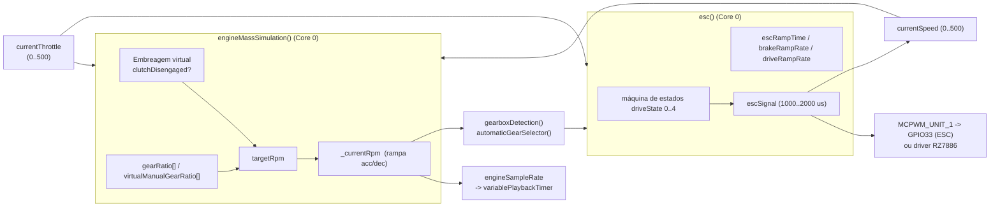
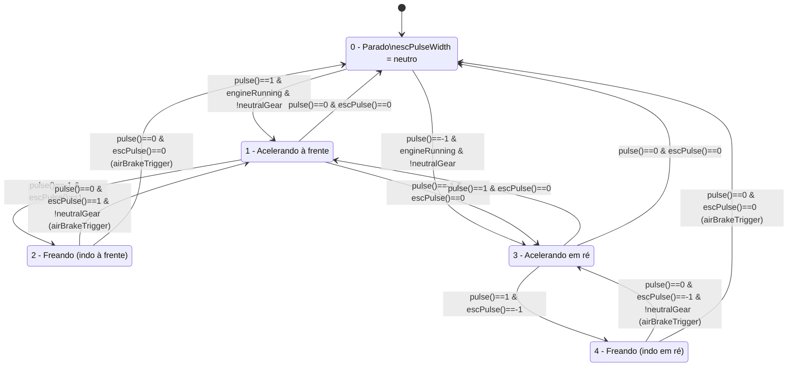
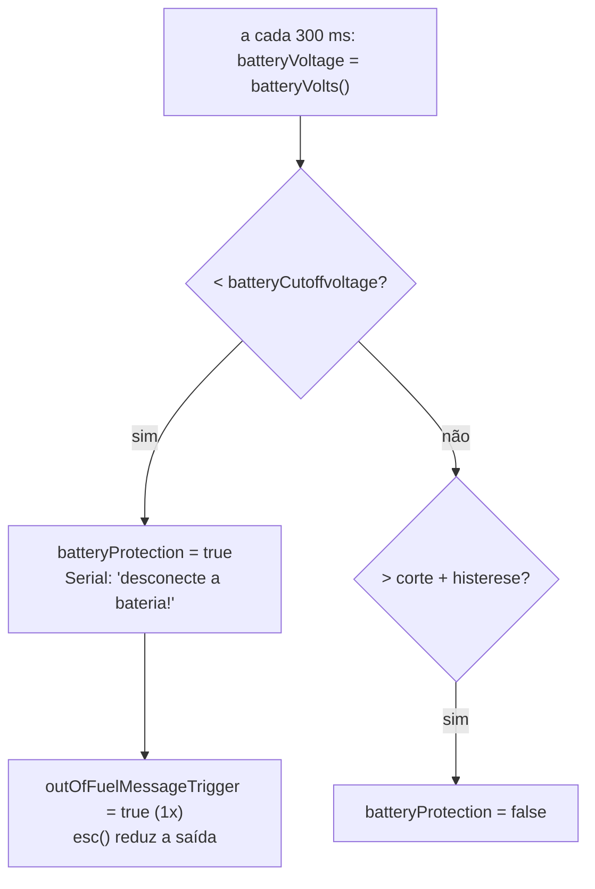

# 06 — Simulação de motor, transmissão e ESC

Estas três funções formam o "modelo físico" do veículo. Todas rodam no **núcleo 0**
(`Task1code`), a maior parte sob o mutex `xRpmSemaphore`.

## `engineMassSimulation()`

Atualiza a cada 2 ms (`timeBase = 2`; 6 ms se `SUPER_SLOW`).

1. **Embreagem virtual** — `clutchDisengaged` fica `true` quando
   `currentSpeed < clutchEngagingPoint` **e** `_currentRpm < maxClutchSlippingRpm`,
   ou durante troca de marcha, ou em ponto morto. Com a embreagem solta o motor pode
   "cortar giro" livremente; engatada, o RPM é escravo da velocidade do ESC.
2. **Cálculo do `targetRpm`** conforme o tipo de transmissão:
   - **Automática**: `currentSpeed * gearRatio[selectedAutomaticGear] / 10 + converterSlip`
     (o `converterSlip` vem de `engineLoad * torqueconverterSlipPercentage`, dobrado em 1ª/ré).
   - **Dupla embreagem**: igual, sem slip.
   - **Manual real (Tamiya 3v)**: `reMap(curveLinear, currentSpeed)`.
   - **`VIRTUAL_3_SPEED` / sequencial 16v**: `reMap(curveLinear, currentSpeed * virtualManualGearRatio[selectedGear] / 10)`.
   - **`LOADER_MODE`**: se `targetHydraulicRpm[0]` (da lança/caçamba) for maior, ele vence.
3. **Rampa de RPM** — acelera de `acc` em `acc` (arquivo do veículo: `acc = 6`),
   desacelera de `dec` em `dec` (`dec = 3`), limitado a `minRpm..maxRpm`. Menos agressivo
   ao reduzir marcha.
4. **Saída**: `engineSampleRate = map(_currentRpm, minRpm, maxRpm, maxSampleInterval, minSampleInterval)`
   → controla o Timer 0 do som. `currentRpm` (global) é publicado.
5. **Gatilhos de som**: `wastegateTrigger` se o acelerador caiu > 70 rápido;
   `blowoffTrigger` durante upshift/neutro (se `JAKEBRAKE_ENGINE_SLOWDOWN`); knock diesel.

Parâmetros relevantes (arquivo do veículo `vehicles/VolvoL120H.h`):

| Parâmetro | Valor | Efeito |
|-----------|-------|--------|
| `automatic` | `true` | usa conversor de torque |
| `NumberOfAutomaticGears` | `1` | carregadeira: 1 marcha à frente (`gearRatio[] = {10, 10}`) |
| `MAX_RPM_PERCENTAGE` | `200` | RPM máx. = 200% do idle (limitado a 320 pelo IBUS) |
| `clutchEngagingPoint` | `500` | embreagem só "cola" no topo |
| `acc` / `dec` | `6` / `3` | inércia do motor |

## Transmissão

- **`gearboxDetection()`** (Core 0): lê a chave de 3 posições no CH2 (`GEARBOX`) e
  decide `selectedGear` (1/2/3), `lowRange`, `neutralGear`. Trata `MODE1_SHIFTING`,
  `SEMI_AUTOMATIC`, `TRANSMISSION_NEUTRAL`, `VIRTUAL_16_SPEED_SEQUENTIAL` (pulsos
  up/down), gera `gearUpShiftingPulse` / `gearDownShiftingPulse` e `shiftingTrigger`
  (som pneumático).
- **`automaticGearSelector()`** (Core 0, só se `automatic || doubleClutch`): sobe/desce
  `selectedAutomaticGear` por histerese de velocidade/carga, com atraso entre trocas;
  suporta `OVERDRIVE`.
- Tabelas em `src/src/curves.h`: `gearRatio[]` (automática, por `NumberOfAutomaticGears`
  3/4/6, com/sem `OVERDRIVE`), `virtualManualGearRatio[]` (`{10,23,14,10,8}` para
  `VIRTUAL_3_SPEED`), `curveLinear[][2]` (curva de RPM manual, versão "truque pesado"
  ou `HIGH_SLIPPINGPOINT` para carros), e as curvas de linearização de ESC
  (`curveQuicrunFusion`, `curveQuicrun16BL30`) e `curveExponentialThrottle`.
- `4_Transmission.h` (global): liga `VIRTUAL_3_SPEED`, `TRANSMISSION_NEUTRAL`;
  `maxClutchSlippingRpm = 250`; opções `DOUBLE_CLUTCH`, `HIGH_SLIPPINGPOINT`,
  `SEMI_AUTOMATIC`, `MODE1_SHIFTING`, `OVERDRIVE` (comentadas).

## `esc()` — máquina de estados `driveState`

Roda no Core 0, dentro do bloco `if (millis() - escMillis > escRampTime)`. Não roda em
`TRACKED_MODE` nem `AIRPLANE_MODE`.

- `pulse()` = direção pedida pelo comando (−1 ré / 0 neutro / 1 frente);
  `escPulse()` = direção atual do sinal do ESC. A combinação dos dois define frenagem
  vs. inversão.
- **Rampa**: `escPulseWidth` caminha até `pulseWidth[3]` a passos de
  `driveRampRate * driveRampGain` (acelerar) ou `brakeRampRate` (frear). `escRampTime`
  (intervalo entre passos) depende da marcha (`escRampTimeFirstGear=5`,
  `SecondGear=50`, `ThirdGear=75` no arquivo do veículo), do modo automático, de
  `lowRange`, de `globalAccelerationPercentage` e do **modo crawler**.
- **Modo crawler** (`masterVolume <= 44`): `escRampTime = crawlerEscRampTime` (10) —
  resposta quase direta, sem inércia virtual, para trialismo.
- **Failsafe**: `brakeRampRate = driveRampRate = escBrakeSteps` (freia forte).
- **`brakeMargin`** (`3_ESC.h`, aqui 10): impede o ESC de voltar totalmente ao neutro
  enquanto o freio está aplicado, evitando que o carro role em ladeira.
- **Saída**:
  - ESC normal: `mcpwm_set_duty_in_us(MCPWM_UNIT_1, MCPWM_TIMER_0, MCPWM_OPR_A, escSignal)` → GPIO33.
  - `RZ7886_DRIVER_MODE`: PWM complementar em GPIO33/32 + drag brake no neutro.
  - `escSignal = map(escPulseWidthOut, escPulseMin, escPulseMax, 1000, 2000)`; `ESC_DIR` inverte.
  - Linearização opcional via `curveQuicrunFusion` / `curveQuicrun16BL30`.
- **`currentSpeed`** (0..500) é derivado de `escPulseWidth` e **realimenta**
  `engineMassSimulation()` (fecha o laço RPM↔velocidade quando a embreagem está engatada).
- Ajustes de topo em `3_ESC.h`: `escPulseSpan = 600` (500 = potência total),
  `escTakeoffPunch = 0`, `escReversePlus = 0`.

## Proteção de bateria (dentro de `esc()`)

- `setupBattery()` / `batteryVolts()`: média de 6 leituras do ADC em GPIO39,
  aplica o divisor (`RESISTOR_TO_BATTTERY_PLUS`, `RESISTOR_TO_GND`, `DIODE_DROP`),
  detecta o número de células (`CELL_SETPOINT`) e emite bipes (`Tone32`).
- Com `batteryProtection == true`, os estados 1 e 3 param de acelerar
  (`&& !batteryProtection`) e forçam `escPulseWidth` de volta ao neutro.
- Mensagem sonora: `vehicles/sounds/OutOfFuelEnglish.h` (há versões DE/FR/NL/ES/PT/JP/CN/TR/RU).

## `engineOnOff()`

Roda no Core 0. Liga/desliga `engineOn` conforme:
- `AUTO_ENGINE_ON_OFF`: liga ao mexer no acelerador, desliga após ~15 s parado.
- Manual: pela função `FUNCTION_R` (CH5) ou pelo **botão A do controle Bluetooth**
  (`processGamepad` → `engineOnOff()`).
