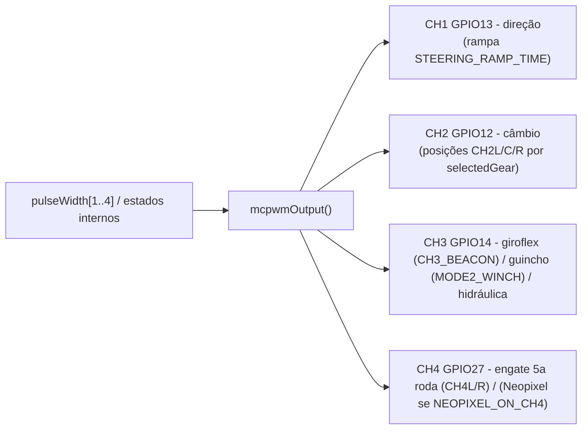

# 07 — Luzes, servos e periféricos

## Luzes — `led()`

Roda no núcleo 0 (`Task1code`), somente depois de `autoZeroDone`. É uma **máquina de
estados** (`lightsState`) que combina:

- Estado do motor (`engineOn`, `engineStart`, `engineRunning`).
- Comando `FUNCTION_R` (CH5): farol baixo/alto, lampejo (headlight flasher), jake brake.
- `driveState` do ESC: `escIsBraking` → luz de freio; `escInReverse` → luz de ré + bipe.
- `AUTO_LIGHTS` (por perfil de rádio): sequência automática de luzes conforme a
  velocidade/estado; senão controlada pelo CH5.
- Setas (`indicatorLon`/`indicatorRon`), pisca-alerta (`hazard`), giroflex azul
  (`blueLightTrigger`, duplo flash ou rotativo conforme `flashingBlueLight`).

Sub-rotinas: `brakeLightsSub(brightness)`, `headLightsSub(head, fog, roof, park)`.
Efeitos: fade tipo lâmpada incandescente (`indicatorFade = 300`), flash de ignição
xênon (`xenonLights`), tremulação durante a partida (`flickeringWileCranking`).

Cada luz é um objeto **`statusLED`** (lib TheDIYGuy999) sobre um canal LEDC de 20 kHz.
Mapa de pinos e canais → [03 — Hardware](03-hardware-e-pinos.md#luzes-ledc--pwm-20-khz--placa-padrão).

Brilhos e comportamento são ajustáveis em `6_Lights.h` **e** na web
(persistem na EEPROM): `cabLightsBrightness`, `sideLightsBrightness`,
`rearlightDimmedBrightness`, `rearlightParkingBrightness`, `reversingLightBrightness`,
`fogLightBrightness`, `xenonLights`, `flickeringWileCranking`, `ledIndicators`,
`swap_L_R_indicators`, `indicatorsAsSidemarkers`, `separateFullBeam`,
`flashingBlueLight`, `hazardsWhile5thWheelUnlocked`.

## Neopixel — `updateRGBLEDs()`

Roda no `loop()` (núcleo 1), só se `NEOPIXEL_ENABLED`. Usa **FastLED** (WS2812) no
`RGB_LEDS_PIN` (GPIO0, ou CH4 se `NEOPIXEL_ON_CH4`).

Config em `6_Lights.h`: `NEOPIXEL_COUNT = 8`, `NEOPIXEL_BRIGHTNESS = 127`,
`MAX_POWER_MILLIAMPS = 100`, `NEOPIXEL_HIGHBEAM` (fita também serve de farol alto).

`neopixelMode` (selecionável na web):

| modo | animação |
|------|----------|
| 1 | Demo |
| 2 | **Knight Rider** (scanner) — usar com som `siren` de `kittScanner.h` — *modo ativo* |
| 3 | Giroflex azul (8 LEDs) |
| 4 | Union Jack (usar com `BritishNationalAnthemSiren.h`) |
| 5 | B33lz3bub (3 LEDs) |

## Saídas de servo — MCPWM

Em modo BUS (SBUS/IBUS/SUMD/PPM) os headers CH1–CH4 viram saídas de servo geradas
pelo periférico **MCPWM** (`setupMcpwm()`), atualizadas por `mcpwmOutput()` no `loop()`.

Perfis em `7_Servos.h` (um `#ifdef` por veículo) definem `CH1L/C/R`, `CH2L/C/R`,
`CH3L/C/R`, `CH4L/R`, `SERVO_FREQUENCY` (50 Hz) e `STEERING_RAMP_TIME` (0 = instantâneo;
~1000–6000 para movimento "de escala"). Perfil ativo: **`SERVOS_DEFAULT`**
(1000/1500/2000, `CH3_BEACON`, `MODE2_TRAILER_UNLOCKING`).
`us2degree()` converte µs ↔ ângulo. O sinal de direção fica suprimido até `autoZeroDone`
(evita "ghost move" em IBUS).

Opções por perfil: `CH3_BEACON`, `MODE2_TRAILER_UNLOCKING`, `MODE2_WINCH`,
`MODE2_HYDRAULIC`, `NO_WINCH_DELAY`.

## Shaker — `shaker()`

Núcleo 0, pulado se `SPI_DASHBOARD`. Motor de vibração no `SHAKER_MOTOR_PIN` (GPIO23,
canal LEDC 13) via objeto `statusLED shakerMotor`. Potência conforme o estado do motor,
valores em `5_Shaker.h` (perfil `GT_POWER_STOCK`):
`shakerStart = 100`, `shakerIdle = 49`, `shakerFullThrottle = 40`, `shakerStop = 60`.

## Dashboard LCD — `updateDashboard()`

Núcleo 1, só se `SPI_DASHBOARD` (**desligado** neste checkout). Display **ST7735 80×160**
via `TFT_eSPI` (parâmetros no `platformio.ini`). Classe `Dashboard` em
`src/src/dashboard.cpp/.h`; logos em `src/src/dashLogos.h` (~250 KB). Mostra RPM,
velocidade (`MAX_REAL_SPEED = 110` km/h), marcha, tensão da bateria.
`dashRotation = 3`. Alternativa `FREVIC_DASHBOARD` em `dashboard.h`.
Ativar o LCD **desabilita** luzes laterais, ambos os giroflex e o shaker (conflito de pinos).

## Reboque sem fio — ESP-NOW

- `setupEspNow()` é chamado **sempre** em `setup()` (inicializa WiFi em modo STA,
  registra `esp_now_send`/callbacks, adiciona os peers dos reboques).
- `trailerControl()` (núcleo 1) monta a struct `trailerData` (luzes lidas de
  `ledcRead(canal)`, pernas/rampas, giroflex) e faz `esp_now_send()` **só quando algo
  muda** (economia de bateria / menos ruído no alto-falante), a cada `pollRate` (~20 ms).
- **Todo o corpo de `trailerControl()` está sob `#if defined ENABLE_WIRELESS`**, que
  **não** está definido em `0_generalSettings.h` neste checkout → a função é efetivamente
  um _no-op_ (apenas `setupEspNow()` roda). Para usar reboque/WiFi, defina
  `ENABLE_WIRELESS`.
- Endereços MAC dos reboques em `10_Trailer.h` (`defaultBroadcastAddress1..3`,
  `defaultUseTrailer1..3`), ajustáveis pela web. `struct_message trailerData`.
- `TRAILER_LIGHTS_TRAILER_PRESENCE_SWITCH_DEPENDENT`: luzes do reboque seguem a chave
  de presença (GPIO32) — incompatível com `THIRD_BRAKELIGHT` / `RZ7886_DRIVER_MODE`.
