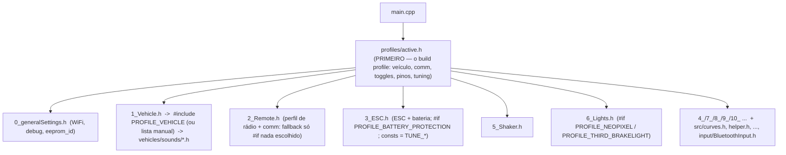

# 08 — Configuração

Toda a personalização é feita por `#define` / variáveis nos cabeçalhos `src/*_*.h`,
lidos em tempo de compilação por `main.cpp`. Algumas variáveis são depois
**persistidas na EEPROM** e podem ser mudadas em runtime pela web ou pelo serial.

## Ordem de inclusão

> `profiles/active.h` é incluído **antes** de `0_`..`10_` de propósito (dirige a seleção
> de veículo e os toggles guardados) — ver [10 — Build profiles](10-profiles-de-build.md).

## Cabeçalhos globais

| Arquivo | Principais chaves |
|---------|-------------------|
| `profiles/*.h` + `platformio.ini` | **o build profile** (`pio run -e <env>`): `PROFILE_VEHICLE`, comm mode, perfil de rádio, `PROFILE_NEOPIXEL`/`PROFILE_BATTERY_PROTECTION`/`PROFILE_THIRD_BRAKELIGHT`/`PROFILE_EXPO_THROTTLE`, `RZ7886_DRIVER_MODE`, pinos, `TUNE_*`. Ver [doc 10](10-profiles-de-build.md). |
| `tuning/agileCar.h` | set `TUNE_*` "carrinho ágil" (usado pelo `carlos_bt_car`). Ver [doc 10](10-profiles-de-build.md) |
| `0_generalSettings.h` | `WEMOS_D1_MINI_ESP32` (vem do profile), flags de `DEBUG`, `eeprom_id = 6`, `ENABLE_WIRELESS` (**off**), `cpType = WIFI_POWER_7dBm`, `default_ssid`/`default_password`, `USE_CSS`/`MODERN_CSS` |
| `2_Remote.h` | perfil de rádio + comm mode (só **fallback** `#if` o profile não escolheu: `FLYSKY_FS_I6S_LOADER` / `IBUS_COMMUNICATION`); `EMBEDDED_SBUS`, `PROFILE_EXPO_THROTTLE`→`EXPONENTIAL_THROTTLE`, `channelReversed[]`/`channelAutoZero[]`, `pulseNeutral`/`pulseSpan` |
| `BluetoothMapping.h` | mapa gamepad→canal + tuning do modo Bluetooth. Ver [doc 11](11-mapa-controle-bluetooth.md) |
| `3_ESC.h` | `QUICRUN_FUSION`/`ESC_DIR` (off); `escPulseSpan`/`escTakeoffPunch`/`crawlerEscRampTime`/`globalAccelerationPercentage` = `TUNE_*` (default overridável pelo profile); `#if PROFILE_BATTERY_PROTECTION`→`BATTERY_PROTECTION` + calibração do divisor + `#include OutOfFuelEnglish.h` |
| `4_Transmission.h` | `VIRTUAL_3_SPEED`, `TRANSMISSION_NEUTRAL`, `maxClutchSlippingRpm=250`, `lowRangePercentage=58`, `automaticReverseAccelerationPercentage=100`; off: `SEMI_AUTOMATIC`, `MODE1_SHIFTING`, `DOUBLE_CLUTCH`, `OVERDRIVE`, `HIGH_SLIPPINGPOINT`, `VIRTUAL_16_SPEED_SEQUENTIAL` |
| `5_Shaker.h` | `GT_POWER_STOCK`, `shakerStart/Idle/FullThrottle/Stop` |
| `6_Lights.h` | `NEOPIXEL_ENABLED`, `NEOPIXEL_COUNT=8`, `NEOPIXEL_BRIGHTNESS=127`, `neopixelMode=2`, `NEOPIXEL_HIGHBEAM`, **`THIRD_BRAKELIGHT`** (GPIO32), + brilhos/flags de luz (EEPROM) |
| `7_Servos.h` | `SERVOS_DEFAULT`, `CH3_BEACON`, `MODE2_TRAILER_UNLOCKING`, limites `CHxL/C/R`, `SERVO_FREQUENCY=50`, `STEERING_RAMP_TIME=0` |
| `8_Sound.h` | `numberOfVolumeSteps=4`, `masterVolumePercentage[]={100,66,44,0}`, `masterVolumeCrawlerThreshold=44`; off: `NO_SIREN`, `NO_INDICATOR_SOUND` |
| `9_Dashboard.h` | `SPI_DASHBOARD` (**off**), `FREVIC_DASHBOARD` (off), `dashRotation=3`, `MAX_REAL_SPEED=110`, `RPM_MAX=500`, `manualGearRatios[3]` |
| `10_Trailer.h` | `defaultUseTrailer1..3`, `defaultBroadcastAddress1..3` (MAC) |

## Presets de veículo — `vehicles/`

`1_Vehicle.h` é uma lista gigante de `#include "vehicles/XXX.h"` comentados; exatamente
**um** fica ativo (aqui: `vehicles/VolvoL120H.h`). Cada preset define, para aquele
veículo: quais arquivos de som usar (`#include "sounds/*.h"`) e seus
`...VolumePercentage`; parâmetros de motor (`acc`, `dec`, `MAX_RPM_PERCENTAGE`,
`clutchEngagingPoint`); tipo de transmissão (`automatic`, `NumberOfAutomaticGears`,
`doubleClutch`, `shiftingAutoThrottle`); rampas de ESC (`escRampTimeFirstGear` etc.);
o **modo** (`LOADER_MODE` / `EXCAVATOR_MODE` / `TRACKED_MODE` / `STEAM_LOCOMOTIVE_MODE` /
`AIRPLANE_MODE` / nenhum).

Existe `vehicles/00_Master.h` (referência com todos os sons possíveis) e ~90 presets
prontos (caminhões US/EU, carros, SUVs, tanques, tratores, escavadeiras, locomotivas,
aviões). Os `.h` de som ficam em `vehicles/sounds/`.

### Trocar o veículo
1. No build profile (`src/profiles/<seu>.h`): `#define PROFILE_VEHICLE "vehicles/<X>.h"`.
   (Sem profile, no fallback: em `1_Vehicle.h`, comente a linha ativa e descomente a desejada.)
2. Confira o **modo de veículo** do novo preset e ajuste `2_Remote.h` (perfil + protocolo)
   e `7_Servos.h` de acordo.
3. Recompile e grave (ver [09](09-build-e-deploy.md)).

## EEPROM

- `EEPROM_SIZE = 512` bytes. Endereços fixos definidos por `#define adr_eprom_*` em
  `main.cpp` (~linhas 545–618): flag de init, MACs de reboque, brilhos/flags de luz,
  parâmetros de ESC, posições de servo, `ssid` (offset 384), `password` (offset 448).
- `setupEeprom()` → `eepromInit()`: se `EEPROM[adr_eprom_init]` diferente de `eeprom_id`
  (5), **grava os defaults** dos cabeçalhos e regrava o id. Ou seja: para forçar reset
  de configuração, **mude `eeprom_id` em `0_generalSettings.h`**.
- `ERASE_EEPROM_ON_BOOT` (nunca deixe ligado) apaga tudo.
- `eepromWrite()` / `eepromRead()` / `eepromDebugRead()`; helpers
  `writeStringToEEPROM` / `readStringFromEEPROM` para SSID/senha.

## Interface web — `192.168.4.1`

- Implementada em `src/src/webInterface.h` (`webInterface()`, chamada no `loop()`).
  Servidor HTTP cru em `WiFiServer server(80)`, HTML gerado por `client.println(...)`,
  com CSS moderno (`USE_CSS` + `MODERN_CSS`).
- **Requer `#define ENABLE_WIRELESS`** em `0_generalSettings.h` (o AP WiFi só sobe
  nesse caso). Aqui está **desativado**.
- Rede: SSID/senha atuais aparecem no **monitor serial** na inicialização (default
  `My_Truck` / `123456789`). Abra `http://192.168.4.1`.
- Permite ajustar em runtime (persistido na EEPROM): SSID/senha, brilhos e flags de
  luz, `neopixelMode`, parâmetros de ESC, posições de servo, opções de reboque,
  `hazardsWhile5thWheelUnlocked`. Seções recolhíveis.

## Interface serial — `serialInterface()`

Em `src/src/serialInterface.h`. **Só compila com `WEMOS_D1_MINI_ESP32`**. Comandos:
`p<n>` = `escPulseSpan` (500–1200), `t<n>` = `escTakeoffPunch` (0–150). Grava na EEPROM
e reinicia. Fora desse board a função é vazia.

## Depuração

Flags em `0_generalSettings.h` (podem deixar o loop de áudio lento — só para debug):
`DEBUG`, `CHANNEL_DEBUG`, `ESC_DEBUG`, `AUTO_TRANS_DEBUG`, `MANUAL_TRANS_DEBUG`,
`TRACKED_DEBUG`, `SERVO_DEBUG`, `ESPNOW_DEBUG`. O monitor serial (115200) também mostra:
versão, clocks, RAM livre, MAC, motivo do reset, calibração de bateria/ESC, offsets de
canal, e (em modo Bluetooth, de `BluetoothInput`) firmware do Bluepad32, BD Addr e
eventos de conexão do controle.
