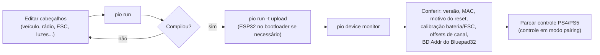

# 09 — Build e deploy

## Ambiente

- **PlatformIO** (recomendado pelo upstream; VS Code + extensão PlatformIO).
- Requer **git** instalado (as libs são baixadas de repositórios git).
- Arduino IDE também é possível, mas exige gerenciar libs/boards à mão e a pilha
  Bluepad32 — **não recomendado neste fork**.

## `platformio.ini` (env `esp32dev`)

```ini
platform          = espressif32@6.10.0
framework         = arduino
platform_packages = framework-arduinoespressif32@
                    https://github.com/maxgerhardt/pio-framework-bluepad32/archive/refs/heads/main.zip
board             = esp32dev
board_build.mcu   = esp32
board_build.f_cpu = 240000000L          ; obrigatório 240 MHz (geração de áudio)
board_build.f_flash        = 40000000L
board_build.partitions     = huge_app.csv   ; app grande, SEM OTA
monitor_speed     = 115200
monitor_filters   = esp32_exception_decoder ; decodifica backtrace
upload_protocol   = esptool
upload_speed      = 921600              ; baixe p/ 115200 se der erro de upload
```

> **Ponto crítico do fork:** `platform_packages` substitui o framework Arduino-ESP32
> padrão pelo fork **`pio-framework-bluepad32`** do `maxgerhardt`, que empacota
> arduino-esp32 2.0.17, IDF 4.4, Bluepad32 4.1.0 e BTstack. É isso que fornece `<Bluepad32.h>` e a pilha
> BT-Classic HID. Sem essa linha, o build quebra em `src/input/BluetoothInput.cpp`.
> Vale fixar num commit (`.../archive/e010351b...zip`) em vez de `main.zip` (alvo móvel).

### `build_flags` — dashboard TFT_eSPI

Mesmo com o dashboard desligado no código, os flags do `TFT_eSPI` são passados
(`-DUSER_SETUP_LOADED=1`, `-DST7735_DRIVER=1`, `-DTFT_WIDTH=80`, `-DTFT_HEIGHT=160`,
`-DST7735_REDTAB160x80=1`, `-DTFT_RGB_ORDER=TFT_BGR`, pinos `TFT_MOSI=23`, `TFT_SCLK=18`,
`TFT_CS=-1`, `TFT_DC=19`, `TFT_RST=21`, fontes `LOAD_GLCD/FONT2/FONT4`,
`SPI_FREQUENCY=27000000`, `USE_HSPI_PORT=1`). Ajuste `TFT_RGB_ORDER` se as cores do LCD
saírem trocadas.

### `lib_deps`

Baixadas automaticamente:

| Lib | Uso |
|-----|-----|
| `SPI` | barramento do LCD |
| `TheDIYGuy999/statusLED` | controle de cada luz + shaker + (base do) ESC |
| `TheDIYGuy999/SBUS` | SBUS (só se **não** `EMBEDDED_SBUS`) |
| `TheDIYGuy999/rcTrigger` | detecção de gatilhos curtos/longos nos canais de função |
| `bmellink/IBusBM` | protocolo IBUS (**ativo**) |
| `Bodmer/TFT_eSPI` **2.3.70** | dashboard LCD (versão fixada — outras quebram) |
| `FastLED` **3.3.3** | fita Neopixel WS2812 |
| `madhephaestus/ESP32AnalogRead` | leitura do divisor de bateria |
| `lbernstone/Tone32` | bipes de detecção de células da bateria |

Bluepad32 vem junto com o pacote do framework, não em `lib_deps`.

## Comandos

```bash
# compilar
pio run

# compilar + gravar (ajuste a porta se preciso: --upload-port COMx)
pio run -t upload

# monitor serial (115200, com decodificador de exceção)
pio device monitor

# limpar
pio run -t clean
```

No VS Code: barra do PlatformIO → **Build** / **Upload** / **Monitor**.

## Fluxo de gravação



## Escolher a configuração (3 seletores)

| Seletor | Arquivo | Opções |
|---|---|---|
| Veículo | `1_Vehicle.h` | um `#include vehicles/*.h` (padrão: `VolvoL120H.h`) |
| Modo de comunicação | `2_Remote.h` | um de `BLUETOOTH_COMMUNICATION` / `IBUS_COMMUNICATION` / `SBUS_COMMUNICATION` / ... (padrão do repo: IBUS) |
| Layout de pinos | `hardwareLayout.h` | `LAYOUT_STOCK_30PIN` (padrão) / `LAYOUT_WEMOS_D1_MINI` / `LAYOUT_CARLOS_BT_CAR` — ver [doc 10](10-layouts-de-hardware.md) |

**Carro Bluetooth (`LAYOUT_CARLOS_BT_CAR`):** em `2_Remote.h`, descomentar
`#define BLUETOOTH_COMMUNICATION` e comentar `#define IBUS_COMMUNICATION`; em
`hardwareLayout.h`, selecionar `#define LAYOUT_CARLOS_BT_CAR`. Ver
[doc 11](11-mapa-controle-bluetooth.md).

## Checklist de primeira gravação

1. `board_build.f_cpu = 240000000L` (não mexer).
2. Conferir os 3 seletores acima.
3. **Modo RC:** calibrar o divisor de bateria em `3_ESC.h` (`RESISTOR_*`, `DIODE_DROP`).
   **`LAYOUT_CARLOS_BT_CAR`:** sem divisor, `BATTERY_PROTECTION` já vem desligado no layout.
4. Se trocou configuração e quer resetar a EEPROM, incrementar `eeprom_id` em
   `0_generalSettings.h`.
5. Gravar, abrir o monitor:
   - **Modo RC:** ligar o rádio/receptor; setas piscam 3× na init do BUS; erro de sinal
     = 3 flashes, erro de bateria = 2 flashes.
   - **Modo Bluetooth:** o boot fica bloqueado (setas piscando 2×) até um controle
     conectar; ponha o DualShock/DualSense em pareamento (PS + Share). Serial mostra
     `Bluepad32 firmware ...` → `controller connected, slot 0` → `RZ7886 motor driver mode configured`.
6. `forgetBluetoothKeys()` **não** é mais chamado no boot — o pareamento persiste.

## Notas

- **Sem OTA** — a partição `huge_app.csv` usa todo o espaço para o app + arrays de som.
- Tamanhos de build de referência: `LAYOUT_STOCK_30PIN` + IBUS ≈ Flash 42.2% / RAM 31%;
  `LAYOUT_CARLOS_BT_CAR` + `BLUETOOTH_COMMUNICATION` ≈ Flash 39.8% / RAM 30.8%.
- `src/src copy.txt` é backup local (gitignored). O output do PlatformIO vai para
  `.pio/build/esp32dev/`; `build/` na raiz e `src/build/` são resíduos.
- Sobre o upgrade para arduino-esp32 3.x / IDF 5.x: **adiado** — não há caminho
  `framework=arduino` + Bluepad32 no core 3.x (seria `framework=espidf` + Arduino-como-
  componente). Fica como projeto separado.
