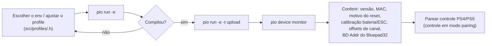

# 09 — Build e deploy

## Ambiente

- **PlatformIO** (recomendado pelo upstream; VS Code + extensão PlatformIO).
- Requer **git** instalado (as libs são baixadas de repositórios git).
- Arduino IDE também é possível, mas exige gerenciar libs/boards à mão e a pilha
  Bluepad32 — **não recomendado neste fork**.

## `platformio.ini` — `[env]` base + um `[env:*]` por profile

```ini
[platformio]
default_envs = l120h_radio            ; env compilado por 'pio run' sem -e

[env]                                 ; base herdada por todos os [env:*]
platform          = espressif32@6.10.0
framework         = arduino
platform_packages = framework-arduinoespressif32@https://github.com/maxgerhardt/pio-framework-bluepad32/archive/refs/heads/main.zip
board             = esp32dev
board_build.f_cpu = 240000000L        ; obrigatório 240 MHz (geração de áudio)
board_build.partitions = huge_app.csv ; app grande, SEM OTA
monitor_speed   = 115200
monitor_filters = esp32_exception_decoder
upload_speed    = 921600             ; baixe p/ 115200 se der erro de upload
build_flags     = ... (flags TFT_eSPI, ver abaixo)

[env:l120h_radio]                     ; -> src/profiles/L120hRadio.h
build_flags = ${env.build_flags} -D PROFILE_L120H_RADIO

[env:carlos_bt_car]                   ; -> src/profiles/CarlosBtCar.h
build_flags = ${env.build_flags} -D PROFILE_CARLOS_BT_CAR

[env:wemos_d1_mini]                   ; -> src/profiles/WemosD1Mini.h
build_flags = ${env.build_flags} -D PROFILE_WEMOS_D1_MINI
```

Cada `[env]` só acrescenta `-D PROFILE_<NOME>`; o `src/profiles/active.h`
(1º `#include` de `main.cpp`) despacha para o arquivo do profile. Ver
[10 — Build profiles](10-profiles-de-build.md).

> **Ponto crítico do fork:** `platform_packages` substitui o framework Arduino-ESP32
> padrão pelo fork **`pio-framework-bluepad32`** do `maxgerhardt`, que empacota
> arduino-esp32 2.0.17, IDF 4.4, Bluepad32 4.1.0 e BTstack. É isso que fornece `<Bluepad32.h>` e a pilha
> BT-Classic HID. Sem essa linha, o build quebra em `src/input/BluetoothInput.cpp`.
> Vale fixar num commit (`.../archive/e010351b...zip`) em vez de `main.zip` (alvo móvel).

### `build_flags` — dashboard TFT_eSPI

Mesmo com o dashboard desligado no código, os flags do `TFT_eSPI` são passados
(`-DUSER_SETUP_LOADED=1`, `-DST7735_DRIVER=1`, `-DTFT_WIDTH=80`, `-DTFT_HEIGHT=160`,
`-DST7735_REDTAB160x80=1`, `-DTFT_RGB_ORDER=TFT_BGR`, pinos `TFT_MOSI=23`, `TFT_SCLK=18`,
`TFT_CS=-1`, `TFT_DC=19`, `TFT_RST=21`, fontes `LOAD_GLCD/FONT2/FONT4`,
`SPI_FREQUENCY=27000000`, `USE_HSPI_PORT=1`). Ajuste `TFT_RGB_ORDER` se as cores do LCD
saírem trocadas.

### `lib_deps`

Baixadas automaticamente:

| Lib | Uso |
|-----|-----|
| `SPI` | barramento do LCD |
| `TheDIYGuy999/statusLED` | controle de cada luz + shaker + (base do) ESC |
| `TheDIYGuy999/SBUS` | SBUS (só se **não** `EMBEDDED_SBUS`) |
| `TheDIYGuy999/rcTrigger` | detecção de gatilhos curtos/longos nos canais de função |
| `bmellink/IBusBM` | protocolo IBUS (**ativo**) |
| `Bodmer/TFT_eSPI` **2.3.70** | dashboard LCD (versão fixada — outras quebram) |
| `FastLED` **3.3.3** | fita Neopixel WS2812 |
| `madhephaestus/ESP32AnalogRead` | leitura do divisor de bateria |
| `lbernstone/Tone32` | bipes de detecção de células da bateria |

Bluepad32 vem junto com o pacote do framework, não em `lib_deps`.

## Comandos

```bash
pio run                                 # compila o env default (l120h_radio)
pio run -e carlos_bt_car                # compila um profile específico
pio run -e carlos_bt_car -t upload      # + grava (--upload-port COMx se não achar)
pio device monitor                      # serial 115200, com decodificador de exceção
pio run -t clean
```

No VS Code (barra do PlatformIO): expanda o env desejado → **Build** / **Upload** / **Monitor**.

## Fluxo de gravação



## Escolher a configuração (1 profile por env)

Não há mais 3 seletores para editar à mão: escolha o **env**.

| env | Profile (`src/profiles/`) | Resumo |
|---|---|---|
| `l120h_radio` (default) | `L120hRadio.h` | Volvo L120H + rádio IBUS + placa 30 pinos + tuning original |
| `carlos_bt_car` | `CarlosBtCar.h` | + `BLUETOOTH_COMMUNICATION` + ponte-H `RZ7886` + pinos do `Controller.ino` + sem Neopixel/bateria/3ª luz de freio + tuning `agileCar.h` |
| `wemos_d1_mini` | `WemosD1Mini.h` | variante Wemos D1 Mini |

Para um carro novo: crie `src/profiles/<Nome>.h`, adicione um `#elif` em
`src/profiles/active.h` e um `[env:<nome>]` no `platformio.ini`. Ver
[10 — Build profiles](10-profiles-de-build.md).

## Checklist de primeira gravação

1. `board_build.f_cpu = 240000000L` (não mexer — está no `[env]` base).
2. Escolher o env: `pio run -e carlos_bt_car -t upload`.
3. **Profiles com rádio (`l120h_radio`):** calibrar o divisor de bateria em `3_ESC.h`
   (`RESISTOR_*`, `DIODE_DROP`). **`carlos_bt_car`:** sem divisor, `PROFILE_BATTERY_PROTECTION 0`.
4. `eeprom_id` foi bumpado 5 → 6 (defaults de ESC via tuning) — a EEPROM é regravada na
   1ª gravação. Para forçar de novo, incrementar `eeprom_id` em `0_generalSettings.h`.
5. Gravar, abrir o monitor:
   - **Modo RC:** ligar o rádio/receptor; setas piscam 3× na init do BUS; erro de sinal
     = 3 flashes, erro de bateria = 2 flashes.
   - **Modo Bluetooth:** o boot fica bloqueado (setas piscando 2×) até um controle
     conectar; ponha o DualShock/DualSense em pareamento (PS + Share). Serial mostra
     `Bluepad32 firmware ...` → `controller connected, slot 0` → `RZ7886 motor driver mode configured`.
6. `forgetBluetoothKeys()` **não** é mais chamado no boot — o pareamento persiste.

## Notas

- **Sem OTA** — a partição `huge_app.csv` usa todo o espaço para o app + arrays de som.
- Tamanhos de referência: `l120h_radio` ≈ Flash 42.2% / RAM 31.0% (byte-equivalente ao
  histórico); `carlos_bt_car` ≈ Flash 39.8% / RAM 30.8% (Neopixel + proteção de bateria fora).
- `src/src copy.txt` é backup local (gitignored). O output do PlatformIO vai para
  `.pio/build/esp32dev/`; `build/` na raiz e `src/build/` são resíduos.
- Sobre o upgrade para arduino-esp32 3.x / IDF 5.x: **adiado** — não há caminho
  `framework=arduino` + Bluepad32 no core 3.x (seria `framework=espidf` + Arduino-como-
  componente). Fica como projeto separado.
