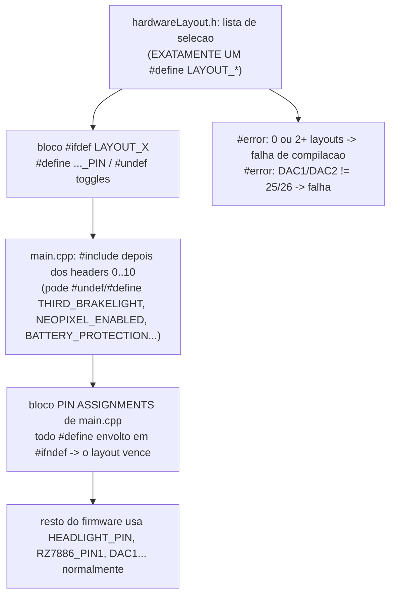

# 10 — Sistema de layouts de hardware

Arquivo: `src/hardwareLayout.h`. Adicionado neste fork (commit `1e61421`).

## Para que serve

O firmware sempre teve os pinos como um bloco fixo de `#define` em `main.cpp` (linhas
~148–285), com variantes espalhadas por `#ifdef` (`WEMOS_D1_MINI_ESP32`,
`THIRD_BRAKELIGHT`, `RZ7886_DRIVER_MODE`, `SPI_DASHBOARD`). O **layout de hardware**
troca esse bloco inteiro por uma *seleção*: um `#define LAYOUT_*` escolhe um conjunto
completo e coerente de pinos + toggles de placa, sem tocar na lógica de som / ESC / luzes.

Mesmo padrão dos **perfis de rádio** em `2_Remote.h` e dos **perfis de servo** em
`7_Servos.h`: lista de seleção + um bloco `#ifdef` por perfil.

## Como funciona

Detalhes:

- **Ordem de inclusão**: `main.cpp` inclui `hardwareLayout.h` **por último** entre os
  headers de config (depois de `0_generalSettings.h` .. `10_Trailer.h`), antes do bloco
  de pinos. Assim o layout pode `#undef`/`#define` os toggles que `3_ESC.h` / `6_Lights.h`
  / `9_Dashboard.h` definem — nenhum desses headers *age* sobre os toggles no include,
  só os define; o consumo acontece em `setup()` e no bloco de pinos, ambos depois.
- **`#ifndef` no bloco de pinos**: cada `#define X_PIN n` em `main.cpp` virou
  `#ifndef X_PIN` / `#define X_PIN n` / `#endif`. Se o layout já definiu, o default é
  pulado — sem warning de "macro redefinida". Os `#ifdef WEMOS_D1_MINI_ESP32` /
  `#if defined THIRD_BRAKELIGHT` internos continuam servindo de default quando o layout
  não define aquele pino.
- **`PWM_PINS[]` / `PWM_CHANNELS[]`** são arrays `const`, não macros — viraram
  `PWM_PINS_INIT` / `PWM_CHANNELS_INIT` (macros com o inicializador), também sob `#ifndef`.
- **`DAC1` / `DAC2` = 25 / 26** são definidos no topo de `hardwareLayout.h`, fora dos
  blocos — imutáveis (é a saída de áudio do motor de som). Um `#error` trava qualquer
  layout que mude isso.

## Layouts existentes

| `#define` | Descrição |
|---|---|
| `LAYOUT_STOCK_30PIN` | Placa padrão TheDIYGuy999 (30 pinos). **Build byte-idêntico ao de antes** — não redefine nada, tudo cai nos defaults de `main.cpp`. |
| `LAYOUT_WEMOS_D1_MINI` | Só ativa `WEMOS_D1_MINI_ESP32` (faróis no GPIO 22, sem luz de cabine, `DEBUG_RX = 3`). |
| `LAYOUT_CARLOS_BT_CAR` | Carro Bluetooth do usuário, derivado de `referencia/Controller.ino`. Ver tabela abaixo. |

## `LAYOUT_CARLOS_BT_CAR`

Origem: sketch do canal **Arduino Para Modelismo** (`referencia/Controller.ino`) —
Bluepad32 + ESP32Servo + ponte-H **L298 Mini** + servo SG90 + LEDs + amplificador de
áudio. Refiação mínima em relação ao `Controller.ino`: ponte-H IN1 movida de GPIO 27
→ GPIO 33; alto-falante novo em 25/26; buzzer do `Controller.ino` (GPIO 25) removido
(função coberta pelo som sintetizado).

| Símbolo do firmware | GPIO | Origem (`Controller.ino`) |
|---|---|---|
| `DAC1` / `DAC2` (áudio → PAM8403) | 25 / 26 | *(novo — buzzer sai)* |
| `STEERING_PIN` (servo, MCPWM unidade 0) | 13 | `SERVO_DIRECAO` |
| `RZ7886_PIN1` (ponte-H IN1, MCPWM unidade 1) | 33 | `PONTE_H_IN01` era 27 → **movido** |
| `RZ7886_PIN2` (ponte-H IN2, MCPWM unidade 1) | 32 | `PONTE_H_IN02` |
| `HEADLIGHT_PIN` | 15 | `FAROL` *(strapping pin)* |
| `FOGLIGHT_PIN` | 2 | `FAROL_MILHA` *(strapping pin)* |
| `TAILLIGHT_PIN` (lanterna + freio) | 4 | `LUZ_FREIO` |
| `INDICATOR_RIGHT_PIN` | 16 | `SETA_DIREITA` |
| `INDICATOR_LEFT_PIN` | 17 | `SETA_ESQUERDA` |
| `REVERSING_LIGHT_PIN` | 22 | `LUZ_RE` |
| `ROOFLIGHT_PIN` | 19 | `LUZ_AUX01` (não usado no `.ino`) |
| `SIDELIGHT_PIN` | 21 | `LUZ_AUX02` (não usado no `.ino`) |
| `CABLIGHT_PIN`, `BEACON_LIGHT1/2_PIN`, `SHAKER_MOTOR_PIN` | -1 | ausentes nesta placa |
| `BATTERY_DETECT_PIN` | 39 | *(sem divisor — `BATTERY_PROTECTION` desligada)* |
| `COMMAND_RX` | 36 | mantido, não usado em modo Bluetooth |

Toggles do bloco: `#define RZ7886_DRIVER_MODE` (ponte-H de 2 pinos genérica),
`#undef THIRD_BRAKELIGHT` (libera GPIO 32), `#undef NEOPIXEL_ENABLED` (sem fita),
`#undef BATTERY_PROTECTION` (sem divisor).

Pinos livres para expansão: 3, 5, 12, 14, 18, 23, 27, 34, 35.

> **Não conectar nada em GPIO 12, 14, 27** neste layout: o `setupMcpwm()` gera sinal de
> servo ocioso neles (canais 2/3/4 do modo BUS, não usados aqui). GPIO 12 é strapping pin
> (deve estar LOW no boot). Uma versão futura restringe o `setupMcpwm()` só à direção em
> modo Bluetooth.

## Como adicionar um layout novo

1. Em `src/hardwareLayout.h`, acrescente `// #define LAYOUT_MINHA_PLACA` na lista de seleção.
2. Crie um `#ifdef LAYOUT_MINHA_PLACA ... #endif` definindo só os pinos que diferem do
   padrão (+ `#undef`/`#define` de toggles, se precisar). O que você não redefinir cai
   no default de `main.cpp`.
3. Adicione `LAYOUT_MINHA_PLACA` à expressão do primeiro `#error` (contagem de layouts).
4. Selecione-o (remova o `//`) e `pio run`. Os `#error` pegam layout duplo/ausente e
   DAC fora de 25/26.

## Verificação (Fase 1)

| Layout | Build |
|---|---|
| `LAYOUT_STOCK_30PIN` | ✅ RAM 31.0% / Flash 42.4% — **igual à baseline** |
| `LAYOUT_WEMOS_D1_MINI` | ✅ |
| `LAYOUT_CARLOS_BT_CAR` (com IBUS) | ✅ Flash 39.8% (Neopixel + proteção de bateria compilados fora) |
| dois `LAYOUT_*` juntos | ✅ falha esperada: `#error "... selecione EXATAMENTE UM LAYOUT_*"` |
