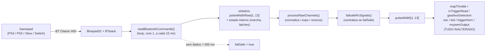

# 11 — Controle Bluetooth (receptor virtual)

Arquivos: `src/input/BluetoothInput.{cpp,h}`, `src/BluetoothMapping.h`.
Ativado por `#define BLUETOOTH_COMMUNICATION` em `src/2_Remote.h`.
Base: framework `pio-framework-bluepad32` (arduino-esp32 2.0.17 + Bluepad32 4.1.0 + BTstack).

## Conceito: "receptor virtual"

O firmware inteiro normaliza qualquer entrada para `pulseWidth[1..13]` em microssegundos
(1000–2000, centro 1500). Em vez de furar essa abstração, o modo Bluetooth **sintetiza
esse array a partir do gamepad** — igual ao que `readSbusCommands()` / `readIbusCommands()`
fazem a partir do rádio.

Nada a jusante de `pulseWidth[]` mudou. `mapThrottle()` voltou ao mapeamento stock
(`pulseWidth[3]` → `currentThrottle`) — o PoC antigo (`BluetoothController.cpp`, que
injetava em `currentThrottle` e acionava a ponte-H por conta própria) foi descartado.

## Como ligar

1. Use um **build profile** com `#define BLUETOOTH_COMMUNICATION` — o `carlos_bt_car`
   (`src/profiles/CarlosBtCar.h`) já vem assim. Ver [10 — Build profiles](10-profiles-de-build.md).
2. `pio run -e carlos_bt_car -t upload`, `pio device monitor` (115200).
3. Coloque o controle em pareamento (DualShock/DualSense: PS + Share ~3 s até a lightbar
   piscar duplo). O boot fica bloqueado (setas piscando 2×) até um controle conectar —
   comportamento igual ao "aguardando sinal RC" dos outros modos.

Para um carro Bluetooth com outra pinagem/veículo: copie `CarlosBtCar.h`, mantenha
`#define BLUETOOTH_COMMUNICATION`, ajuste pinos/tuning, e adicione o `[env]`
correspondente (ver doc 10).

## Mapa gamepad → canal

### Fase 4a (implementada) — dirigir + som

| Controle (PS4) | Canal | Efeito |
|---|---|---|
| Analógico esquerdo, eixo X | CH1 `STEERING` | Servo de direção (GPIO 13). `map(axisX, -512..511, 1020..1980)`, zona morta 24 |
| **R2** (gatilho) | CH3 `THROTTLE` | Acelerador para frente. `1500 + (R2/1020)·480` |
| **L2** (gatilho) | CH3 `THROTTLE` | Freio / ré. Subtrai de CH3: `net = R2 − L2` |
| **R1** / **L1** | CH2 `GEARBOX` | Marcha +/− (estado interno 1..3 → 1000/1500/2000 µs). Borda de subida |
| **Quadrado** (`x()`) | CH4 `HORN` | Buzina (momentâneo → 1980 µs; `> 1900` dispara `hornTrigger`) |
| **X / Cross** (`a()`) | CH10 `MOMENTARY1` | Liga/desliga motor. Segurar ~0,1 s → `momentary1Trigger.toggleLong()` alterna `engineOn` |
| — | CH5–9, CH11–13 | Neutro (1500) — não sintetizados |

### Fase 4b (implementada) — controles de "experiência"

Estes **não** passam por canal RC: `BluetoothInput.cpp` escreve direto nas globais do
firmware (via `extern`), porque CH5 é multiplexado + invertido + auto-zero e daria um
mapeamento frágil.

| Controle (PS4) | Global | Efeito |
|---|---|---|
| **D-pad ↑** | `volumeIndex` ++ (limite `numberOfVolumeSteps-1`) | volume + · aplica `masterVolume = masterVolumePercentage[volumeIndex]` |
| **D-pad ↓** | `volumeIndex` −− (limite 0) | volume − |

> **Direcionais invertidos neste controle:** o gamepad do usuário entrega os bits de
> ↑/↓ trocados (a seta para baixo subia o volume). `BluetoothInput.cpp` troca
> `BT_DPAD_UP`/`BT_DPAD_DOWN` (0x02/0x01) para bater com o rótulo. ←/→ ficaram nominais.

**Passos de volume** (`src/8_Sound.h`, `masterVolumePercentage[]`): agora **8** —
`{100, 88, 75, 66, 55, 44, 22, 0}` (era `{100, 66, 44, 0}`). Resolução mais fina na
faixa audível (100…55) antes de o crawler entrar. Vale para o CH5 dos modos RC também.
| **D-pad →** | `lightsState = (>=5) ? 0 : +1` | cicla os 6 estágios de luz (apagado → meia-luz → baixo → neblina → tudo) |
| **D-pad ←** | `headLightsHighBeamOn = !` | farol alto on/off (só visível com farol ligado, estágio ≥ 3; `led()` zera se não houver farol) |
| **PS** segurado ~2 s | — | `BP32.forgetBluetoothKeys()` + `ESP.restart()` (re-parear) |

Detecção por **borda de subida** do `dpad()` (`s_prevDpad`) — pressionar dispara uma vez.

> **Acoplamento volume ↔ pilotagem:** `masterVolumePercentage[] = {100, 88, 75, 66, 55, 44, 22, 0}`.
> Os passos de índice ≥ 5 (44 %, 22 %, mudo) têm `masterVolume ≤ masterVolumeCrawlerThreshold`
> (44) → o `esc()` liga o **crawler mode** (controle direto, sem inércia virtual). Ou seja,
> baixar o volume até "silêncio/mudo" também deixa a pilotagem 1:1. Um toggle dedicado de
> "controle direto" (R3, desacoplado do volume) fica para a Fase 4c.

### Fase 4c (a fazer)

- **Setas + hazard** (CH6 `FUNCTION_L` / global `hazard`).
- **Feedback**: rumble em troca de marcha / partida / perto do corte de giro; cor da
  lightbar por estado do motor; LEDs de player = marcha atual.
- **Toggle de "controle direto"** (R3) — desacopla `crawlerMode` de `masterVolume` no `esc()`.
- **Debug**: `#define BLUETOOTH_DEBUG` no estilo do `CHANNEL_DEBUG`.
- `forgetBluetoothKeys()` **nunca no boot** — só no gesto PS (já feito na 4b).

## Constantes de ajuste — `src/BluetoothMapping.h`

| Constante | Padrão | Efeito |
|---|---|---|
| `BT_UPDATE_INTERVAL_MS` | 15 | Período de `BP32.update()` + reamostragem (~66 Hz) |
| `BT_FAILSAFE_TIMEOUT_MS` | 500 | Sem dados do gamepad por mais que isso → `failSafe` (canais ao centro) |
| `BT_PULSE_CENTER` / `BT_PULSE_SPAN` | 1500 / 480 | Faixa dos canais sintetizados (bate com `pulseSpan` do perfil) |
| `BT_TRIGGER_MAX` / `BT_TRIGGER_DEADZONE` | 1020 / 20 | Faixa/zona morta de `throttle()`/`brake()` (0..1023) |
| `BT_AXIS_MIN/MAX` / `BT_AXIS_DEADZONE` | −512..511 / 24 | Faixa/zona morta de `axisX()` |
| `BT_GEAR_US[]` | {—, 1000, 1500, 2000} | µs de cada posição de marcha |
| `BT_REPAIR_HOLD_MS` | 2000 | Segurar PS por mais que isso → esquece pareamentos + reinicia |

## Failsafe

`readBluetoothCommands()` marca `failSafe = (millis() - últimoDado > BT_FAILSAFE_TIMEOUT_MS)`.
Quando `failSafe`, `failsafeRcSignals()` força `pulseWidth[]` ao centro (exceto CH1/2/8/9),
o `esc()` entra em rampa de frenagem de emergência e o motor vai a zero. Cobre
desconexão, controle desligado e saída de alcance do Bluetooth.

## Latência dos comandos — ajuste (config, sem código)

O preset **Volvo L120H** simula a **inércia de uma carregadeira pesada**. Num carrinho
pequeno isso vira "delay" perceptível na aceleração. Cadeia:

- `esc()` só avança a máquina de estados **a cada `escRampTime`**; para transmissão
  automática, `escRampTime = escRampTimeSecondGear` (**50 ms** em `VolvoL120H.h`).
- Por passo, `escPulseWidth += driveRampRate · driveRampGain` — no máximo `5 · 4 = 20`.
- Do neutro (1500) até potência total (~1980): 24 passos × 50 ms ≈ **1,2 s**.
- Compõe com a ponte-H **L298 Mini** + atrito do motor: abaixo de um PWM mínimo o motor
  nem gira, e `escTakeoffPunch = 0` não dá "arranque".

Knobs para um carro ágil:

| Arquivo | Parâmetro | Padrão | Sugerido p/ carrinho |
|---|---|---|---|
| `vehicles/VolvoL120H.h` | `escRampTimeSecondGear` | 50 | 15–20 |
| `vehicles/VolvoL120H.h` | `escAccelerationSteps` | 5 | 10–15 |
| `vehicles/VolvoL120H.h` | `escBrakeSteps` | 100 | 30–40 |
| `vehicles/VolvoL120H.h` | `acc` / `dec` (som do motor) | 6 / 3 | 12 / 6 |
| `3_ESC.h` | `escTakeoffPunch` (arranque p/ vencer o atrito) | 0 | 50–80 |
| `3_ESC.h` | `globalAccelerationPercentage` (divide `escRampTime`) | 100 | 150 |
| `3_ESC.h` | `crawlerEscRampTime` (modo crawler = controle quase direto) | 10 | — |

Atalho: `masterVolume ≤ 44` (os 3 passos de volume mais baixos) liga o **modo crawler**
(`escRampTime = crawlerEscRampTime`, quase sem inércia virtual).

A **buzina** em si não tem atraso na lógica (`triggerHorn()` dispara no mesmo ciclo);
o que se ouve é a natural entrada do arquivo de som `CarHorn.h`.
